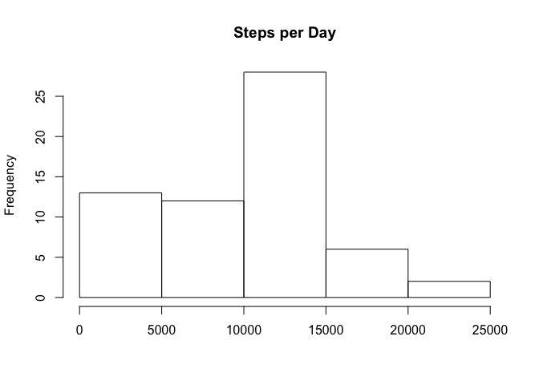
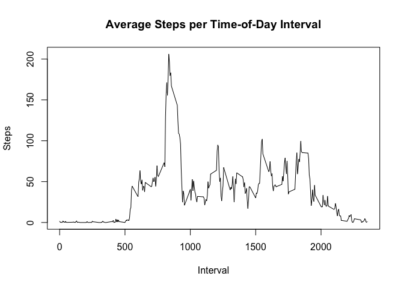
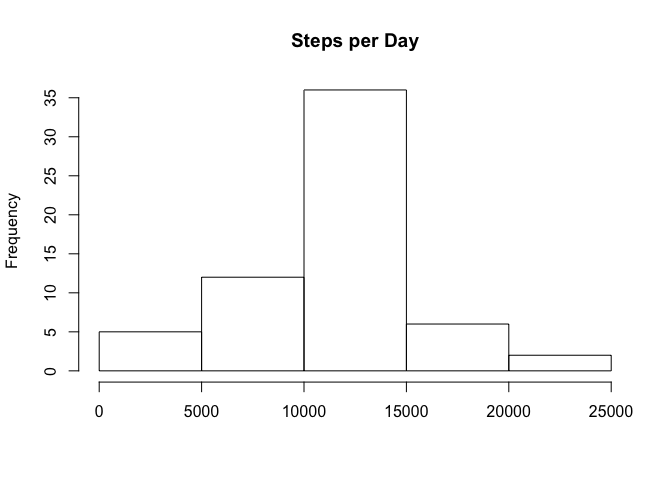
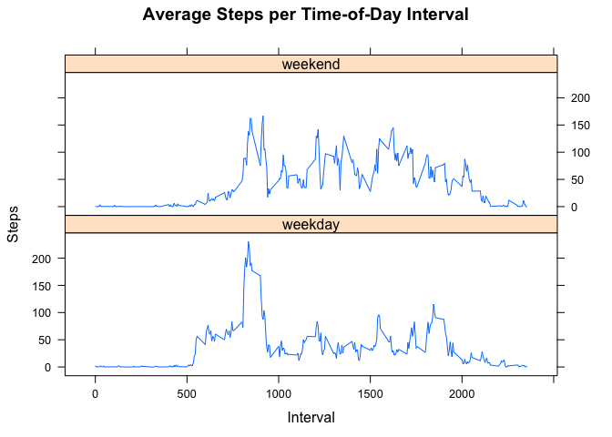

# Reproducible Research: Peer Assessment 1


## Loading and preprocessing the data

Since the data are straightforward and we're initially ignoring missing values, there's no preprocessing to do, just unzip and read in the data.

```r
unzip("activity.zip")
data <- read.csv("activity.csv")
```


## What is mean total number of steps taken per day?

Sum the number of steps for each date, removing missing values:

```r
daysteps <- tapply(data$steps, data$date, "sum", na.rm=TRUE)
```

Here's what the distribution looks like:

```r
hist( daysteps, main="Steps per Day", xlab="" )
```

<!-- -->

And the mean and median:

```r
mean(daysteps)
```

```
## [1] 9354.23
```

```r
median(daysteps)
```

```
## [1] 10395
```

The distribution seems a little skewed, but stay tuned.


## What is the average daily activity pattern?

Take averages across days by interval, and display the results:

```r
intervalsteps <- tapply(data$steps, data$interval, "mean", na.rm=TRUE)
plot( as.numeric(names(intervalsteps)), intervalsteps, 
      xlab="Interval", ylab="Steps",
      main="Average Steps per Time-of-Day Interval", type="l")
```

<!-- -->

The interval with the maximum average daily number of steps:

```r
names(which.max(intervalsteps))
```

```
## [1] "835"
```

Not surprising that the maximum is around 8:30 AM, when it's time to go to work.


## Imputing missing values

There are a lot of missing values:

```r
sum(is.na(data$steps))
```

```
## [1] 2304
```

I replace missing values with the average across days for the time interval:

```r
newdata <- data
# Replicate "avearge steps across days for the given time interval"
#   for each day of the sample
s <- intervalsteps[as.factor(data$interval)]
# Find the missing values
nas <- is.na(data$steps)
# Loop through the data, setting missing data equal to averages
for (i in 1:length(nas)) { if (nas[[i]]) { newdata$steps[i] <- s[i] } }
```

With the missing values imputed, the distribution of steps per day no longer looks so skewed:

```r
newdaysteps <- tapply(newdata$steps, newdata$date, "sum", na.rm=TRUE)
hist( newdaysteps, main="Steps per Day", xlab="" )
```

<!-- -->

The mean and median are now close:  

```r
mean(newdaysteps)
```

```
## [1] 10766.19
```

```r
median(newdaysteps)
```

```
## [1] 10766.19
```

Actually, they're identical, probably because there were a lot of days where all or nearly all the data were missing.  Those data were imputed using averages across days, and so the totals for those days look like the average.  The median is now one of those "imputedly average" days.  But this result does suggest that the skewness of the original distribution was an artifact of missing data.

## Are there differences in activity patterns between weekdays and weekends?

Generate factor to identify weekends:

```r
days <- weekdays(as.POSIXct(data$date))
f = factor( days %in% c("Saturday","Sunday"), labels=c("weekday","weekend") )
```

Calculate weekday and weekend averages of steps for each interval:

```r
wddata <- newdata[f=="weekday",]
wedata <- newdata[f=="weekend",]
wdsteps <- tapply(wddata$steps, wddata$interval, "mean")
westeps <- tapply(wedata$steps, wedata$interval, "mean")
allsteps <- rbind( cbind( wdsteps, "weekday", names(intervalsteps)), 
                  cbind( westeps, "weekend", names(intervalsteps)) )
```

There is some difference in pattern:

```r
library(lattice)
xyplot(as.numeric(allsteps[,1]) ~ as.numeric(allsteps[,3]) | allsteps[,2], 
                  layout = c(1, 2), type='l', xlab='Interval', ylab="Steps",
                  main="Average Steps per Time-of-Day Interval")
```

<!-- -->

The time of the peak is close, but on weekdays, it is more acute, and it is preceded by a plateau.  It looks like the subject gets up later on weekends but reaches peak activity more quickly and is more active after the peak.  Not surprising.

